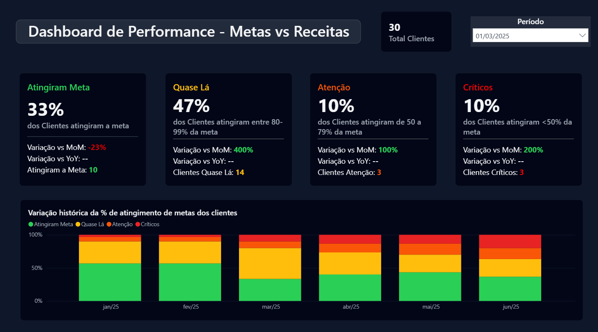
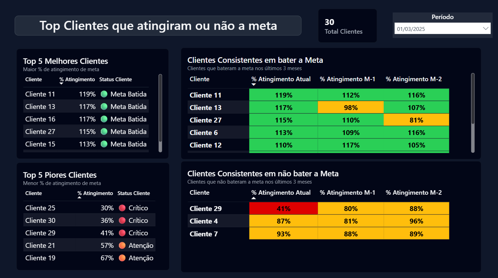
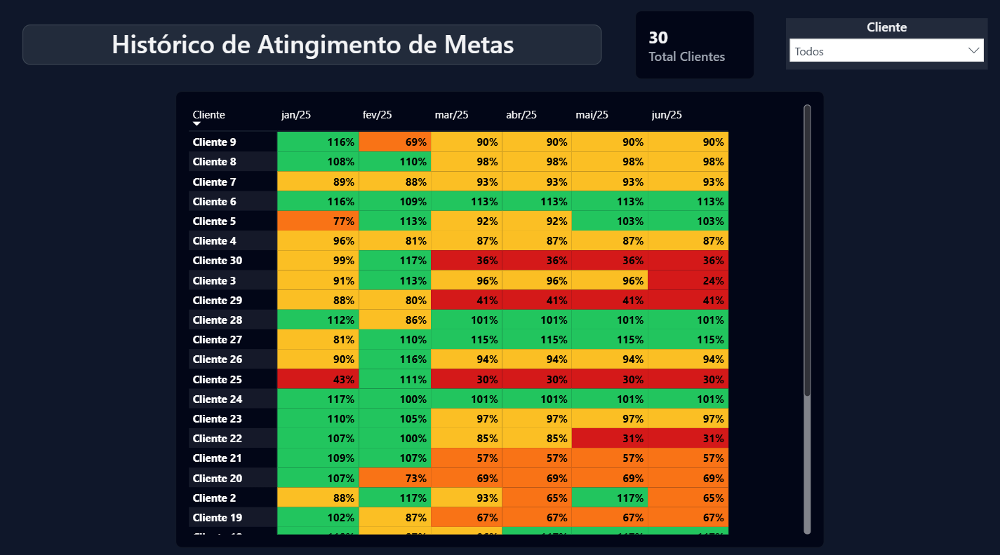

# 🎯 Dashboard de Atingimento de Metas dos Clientes

Dashboard desenvolvido para acompanhar o **atingimento de metas de receita e performance por cliente**, com análise histórica e indicadores de consistência.  
O objetivo é fornecer uma visão clara sobre **quem está atingindo, quase atingindo ou abaixo das metas**, além de destacar tendências mensais e variações de desempenho.

---

## 📊 Visão Geral

A dashboard permite:

- Avaliar **a performance geral de clientes em relação às metas de receita**.  
- Visualizar **histórico mensal** de atingimento por cliente.  
- Identificar **padrões de consistência** (quem mantém bom desempenho por vários meses).  
- Analisar a **variação MoM (Month-over-Month)** e **YoY (Year-over-Year)**.  
- Explorar o **faturamento real vs meta** ao longo do tempo.

---

## 🧠 Principais Indicadores

### 1️⃣ **Dashboard de Performance — Metas vs Receitas**
📌 Mostra a proporção de clientes que:
- ✅ **Atingiram a meta** (≥100%)  
- 🟡 **Quase lá** (80–99%)  
- 🟠 **Atenção** (50–79%)  
- 🔴 **Críticos** (<50%)  

Inclui:
- Variação MoM (%) e YoY (%)  
- Total de clientes no período  
- Histórico visual de atingimento (barras empilhadas com % por categoria)

📷 **Exemplo:**  

---

### 2️⃣ **Top Clientes que Atingiram ou Não a Meta**
📊 Exibe:
- **Top 5 melhores clientes** (% de atingimento mais alto)  
- **Top 5 piores clientes** (% de atingimento mais baixo)  
- **Clientes consistentes** (mantêm padrão de resultado nos últimos 3 meses)  

💡 Destaques:
- Escala de cores para status (`Meta Batida`, `Crítico`, etc.)  
- Indicadores comparativos entre meses (M, M-1, M-2)

📷 **Exemplo:**  

---

### 3️⃣ **Histórico de Atingimento**
📈 Mapa de calor com a **evolução mensal do atingimento de metas por cliente**.  
Permite comparar rapidamente quem está melhorando ou piorando ao longo dos meses.

📷 **Exemplo:**  

---

### 4️⃣ **Faturamento vs Meta**
📊 Gráfico combinado de **barras (receita real)** e **linha (meta)** para análise comparativa ao longo do tempo.

📷 **Exemplo:**  

---

## 🧩 Arquitetura de Dados

Os dados seguem as fontes abaixo descritas:

| Fonte | Descrição | Campos principais |
|-------|------------|-------------------|
| **Shopify / Plataforma E-commerce** | Pedidos e faturamento por cliente | date, order_id, revenue, customer_id |
| **Metas** | Metas de receita por cliente e período | customer_id, target_revenue, period |
| **Calendário (dCalendario)** | Tabela de granularidade diária, semanal e mensal | date, month, week, year |

---

## 💡 Aprendizados Técnicos

- Construção de **painel 100% automatizado** com atualização via Power BI Service  
- Uso de **medidas DAX dinâmicas** para cálculo de atingimento, consistência e variação temporal  
- **Modelagem relacional** entre vendas, metas e calendário  
- Aplicação de **formatação condicional e heatmaps customizados**  
- Criação de **navegação interativa** entre páginas com botões e bookmarks

---

## 🚀 Próximos Passos

- Refinar UX, reduzindo sobrecarga visual e otimizando painéis-chave  
- Implementar **atualização incremental** para grandes volumes históricos  
- Ajustar performance e reduzir custo de renderização no Power BI Service  
- Adicionar **filtros inteligentes e insights automáticos por cliente**

